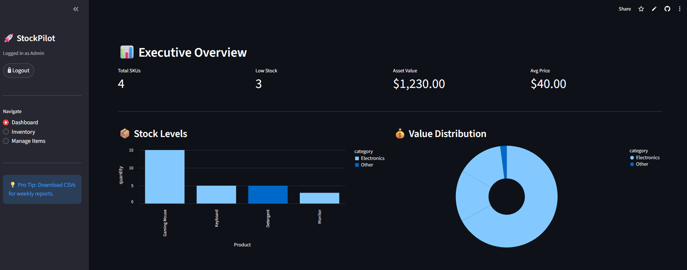

# 🚀 StockPilot


**StockPilot** is a professional Inventory Management System designed to bridge the gap between physical stock and digital tracking. By integrating a real-time **Supabase** cloud database with **Streamlit**, it allows businesses to track assets, visualize value distribution, and auto-generate QR codes for seamless inventory control.

---

<div align="center">
  
</div>

---

### StockPilot Pro 📦
**Turn your manual inventory spreadsheets into a modern, automated dashboard.**

📂 **Source Material**
* **Real-time Database:** Connects directly to Supabase (PostgreSQL).
* **Live Analytics:** Tracks Total SKUs, Low Stock Alerts, and Asset Value.

<br>

### 🚀 Key Features

* 📊 **Executive Dashboard:** Uses Altair charts for interactive visualization of stock levels and value distribution.
* ☁️ **Cloud Database:** Fully integrated with **Supabase** for persistent, secure data storage (CRUD).
* 📱 **QR Code Generation:** Auto-generates unique QR codes for every product using the `qrcode` library.
* 🔒 **Secure Access:** Built-in Admin Authentication system to protect sensitive database operations.
* 📉 **Smart Alerts:** Visual progress bars and toast notifications for low-stock items.
* 📥 **Data Export:** One-click CSV export for reporting and external analysis.
* 🎨 **Modern UI:** A custom-styled interface featuring Dark Mode, Glassmorphism cards, and responsive tabs.

### 🛠️ Tech Stack

* **Frontend:** Streamlit (Custom CSS styling)
* **Backend:** Python 3.x
* **Database:** Supabase (PostgreSQL)
* **Visualization:** Altair & Pandas
* **Utilities:** Qrcode, Pillow

---

## 📦 How to Run Locally

1. **Installation**
   Clone the repo, set up the environment, and install requirements in one go:

   ```bash
   # Clone repository
   git clone [https://github.com/JannElijah/StockPilot.git](https://github.com/JannElijah/StockPilot.git)
   cd StockPilot

   # Create and activate virtual environment (Windows)
   python -m venv venv
   .\venv\Scripts\activate

   # Install dependencies
   pip install -r requirements.txt
   ```
   *(Note: If on Mac/Linux, use `source venv/bin/activate` instead of the Windows command above)*

2. **Configuration**
   Create a folder named `.streamlit` and a file inside named `secrets.toml` with your database credentials:

   ```toml
   [secrets]
   SUPABASE_URL = "your_supabase_url"
   SUPABASE_KEY = "your_supabase_anon_key"
   ADMIN_PASSWORD = "StockPilot2025!"
   ```

3. **Launch App**
   Run the dashboard:
   ```bash
   streamlit run app.py
   ```


## 🔑 Configuration

To use the Database features, you need a Supabase Project.

Get a free project at Supabase.

Run the SQL query provided in the repo to create the inventory table.

Enter the URL and Key in the secrets.toml file (Step 4 above).

## 👤 Author

**Jann Elijah B. Limpiado**
<br>
*3rd Year IT Student*

[](https://www.linkedin.com/in/jannlimpiado)
[](https://github.com/JannElijah)

Created for Portfolio 2025